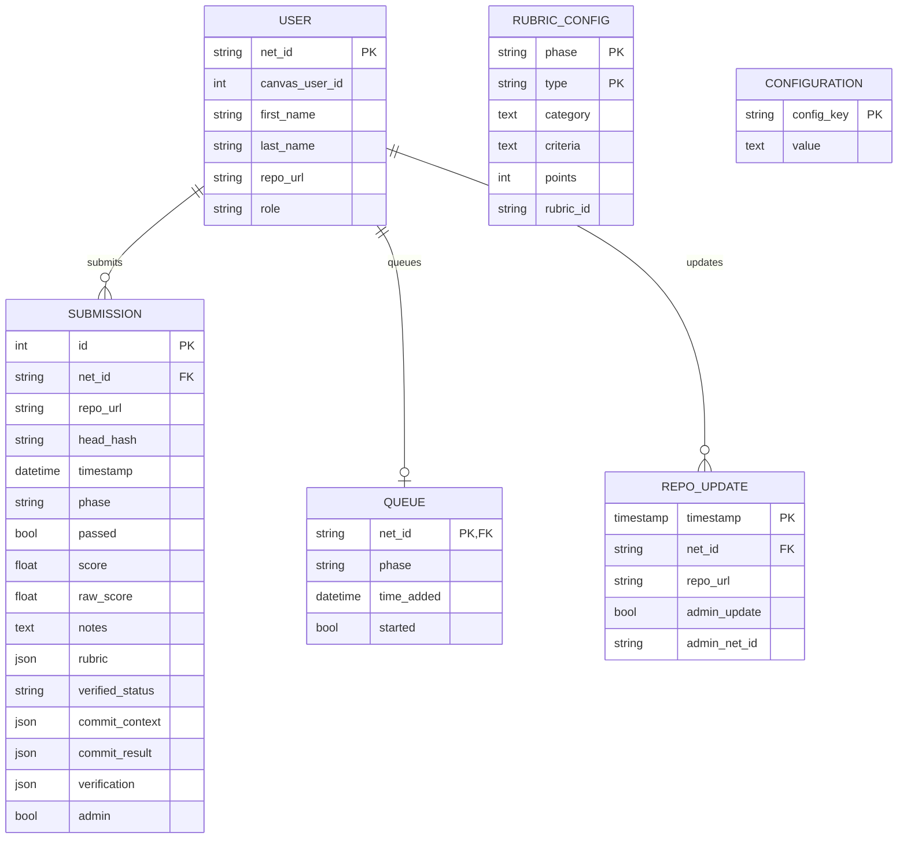

# Class Entity Relationships

This Entity Relationship Diagram (ERD) represents the database schema for the **CS 240 AutoGrader** project, an automated system for managing student submissions, evaluating code, and assigning grades.

## Entity Overview

The system tracks users, including students and administrators, through the `USER` table, where each user is uniquely identified by their `net_id`. When a student submits their code, the submission details—including repository information, commit data, and grading results—are stored in the `SUBMISSION` table. The `QUEUE` table manages submissions awaiting evaluation, ensuring that each student's work is processed in the order it was received.

To support grading consistency, the `RUBRIC_CONFIG` table defines grading criteria, associating different grading components with specific phases of the submission process. The `CONFIGURATION` table stores system-wide settings, allowing administrators to fine-tune the AutoGrader’s behavior remotely. Additionally, the `REPO_UPDATE` table logs updates to repositories, tracking changes made by both students and administrators.

For details on the `commit_context`, `commit_result`, and `verification` fields in the `SUBMISSION` table, refer to the [Git Commit Verification documentation](./git-commit-verification.md).

More details about the `CONFIGURATION` table will be available soon. Stay tuned!

## Diagram

