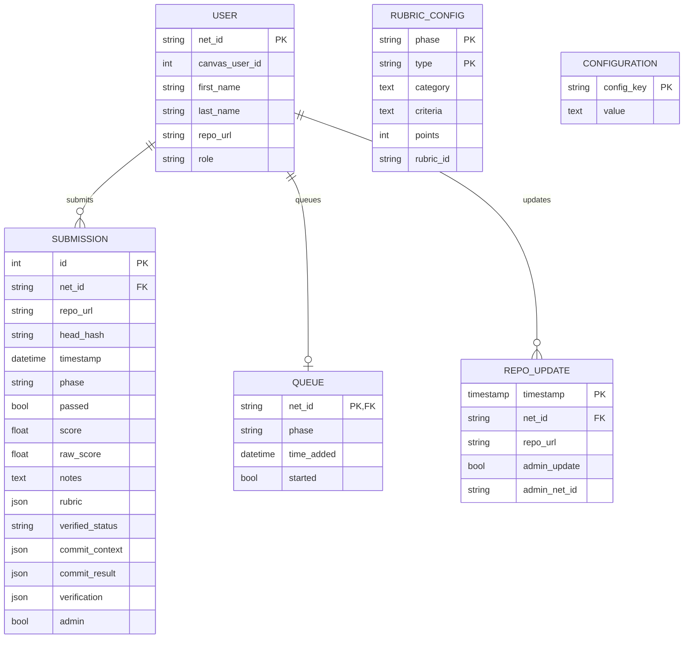

# Autograder Class Entity Relationships

## Diagram

```mermaid
erDiagram

USER {
    string net_id PK
    int canvas_user_id
    string first_name
    string last_name
    string repo_url
    string role
}

SUBMISSION {
    int id PK
    string net_id FK
    string repo_url
    string head_hash
    datetime timestamp
    string phase
    bool passed
    float score
    float raw_score
    text notes
    json rubric
    string verified_status
    json commit_context
    json commit_result
    json verification
    bool admin
}

QUEUE {
    string net_id PK, FK
    string phase
    datetime time_added
    bool started
}

RUBRIC_CONFIG {
    string phase PK
    string type PK
    text category
    text criteria
    int points
    string rubric_id
}

CONFIGURATION {
    string config_key PK
    text value
}

REPO_UPDATE {
    timestamp timestamp PK
    string net_id FK
    string repo_url
    bool admin_update
    string admin_net_id
}

USER ||--o{ SUBMISSION : submits
USER ||--o| QUEUE : queues
USER ||--o{ REPO_UPDATE : updates
```
