# Git Commit Verification

This Sequence Diagram is provided to help put each of the internal methods
in their proper context in the bigger picture. Minor details are omitted,
but emphasis is placed on actions that directly affect the user 
(like sending notifications to `Grader`), and network calls to DAOs.
Emphasis is placed on showing where system requirements are calculated in the logical flow.

Locating a particular function on this map should visualize how it is being used,
and therefore enable future developers to understand behavior and extend functionality.

## Participant Overview

| Participant | Notes |
| :---------- | :---- |
| `Grader` | Driver class responsible for running the grading algorithm. |
| `Observer` | Sends updates to display directly to student. |
| **`GitHelper`** | **Driver class for git commit verification.** Contains a few reusable methods in other contexts. |
| `SubmissionDao` | Interacts with a database over the internet. |
| `CommitAnalytics` | Intentionally separates low-level interactions with actual `git` commits from the higher level algorithm. |
| `CommitVerificationStrategy` | [Strategy pattern](https://refactoring.guru/design-patterns/strategy) intentionally separates the interpretation of the commit results from analysis algorithm. |

## Sequence Diagram

```mermaid
---
title: AutoGrader — Git Commit Verification Sequence Diagram
---

sequenceDiagram

participant Grader
participant Observer
participant GitHelper
participant SubmissionDao
participant CommitAnalytics
participant CommitVerificationStrategy

%% GRADING INITIALIZATION
note over Grader,GitHelper: Grading initialization
Grader->>+Grader: new Grader(...)
Grader->>GitHelper: new GitHelper(gradingContext)
GitHelper->>CommitVerificationStrategy: new DefaultGitVerificationStrategy()
Grader-->>-Grader: Grader

%% GRADING EVALUATION
note over Grader,GitHelper: Grading evaluation
Grader->>+Grader: run()
Grader->>+GitHelper: setUpAndVerifyHistory()

%% Initial internal setup
GitHelper->>+GitHelper: setUp()
note right of GitHelper: Download repository from internet <br>and determine head hash
GitHelper-->>-GitHelper: void
%% Finish internal setup

%% Decision making points
GitHelper->>+GitHelper: verifyCommitHistory()
GitHelper-->>Observer: update("Verifying commits...")
GitHelper->>+GitHelper: shouldVerifyCommits()
note right of GitHelper: Consider admin and phase<br>grading requirements
GitHelper-->>-GitHelper: boolean

    alt shouldVerifyCommits
        %% Verify commit requirements
        GitHelper->>+GitHelper: verifyCommitRequirements()

            %% Preserving original verification results
            GitHelper->>+GitHelper: preserveOriginalVerification()
            GitHelper->>SubmissionDao: getFirstPassingSubmission(netId, phase)
            GitHelper->>GitHelper: generateFailureMessage(verified, firstPassingSubmission)
            GitHelper-->>-GitHelper: CommitVerificationResult | null
            opt if verification != null
                GitHelper-->>GitHelper: return verification
            end

            %% Determine commit ranges
            GitHelper->>SubmissionDao: getAllPassingSubmissions(netId)
            GitHelper->>+GitHelper: getMostRecentPassingSubmission(passingSubmissions)
            note right of GitHelper: Evaluate commit ancestry and<br>submissions timestamps. <br>Represents the submission from<br> the previous phase.
            GitHelper-->>-GitHelper: CommitThreshold

            GitHelper->>+GitHelper: constructCurrentThreshold()
            note right of GitHelper: Represents the instant the<br> submission was received
            GitHelper-->>-GitHelper: CommitThreshold

            %% Perform commit verification
            GitHelper->>+GitHelper: verifyRegularCommits(lowerThreshold, upperThreshold)
            loop do until no repeat requested
                GitHelper->>+CommitAnalytics: countCommitsByDay()
                note over CommitAnalytics: Analyze all commits between<br>thresholds, checking conditions<br> and tallying violations
                CommitAnalytics-->>-GitHelper: CommitsByDay

                GitHelper->>+CommitVerificationStrategy: evaluate(CommitVerificationContext, GradingContext)
                note over CommitVerificationStrategy: Review results to determine<br>if the submission passes.<br> Optionally, signal to repeat by<br> returning an exclude set of commit hashes.
                CommitVerificationStrategy-->>-GitHelper: Collection<String> excludeCommitHashes | null
            end
            GitHelper->>CommitVerificationStrategy: getWarnings()
            GitHelper->>CommitVerificationStrategy: getErrors()

            GitHelper-->>-GitHelper: CommitVerificationResult

        GitHelper-->>-GitHelper: CommitVerificationResult
        %% End commit verification
    else
        GitHelper->>+GitHelper: skipCommitVerification()
        note right of GitHelper: Return empty, valid verification
        GitHelper-->>-GitHelper: CommitVerificationResult
    end

    loop warning in warningMessages
        GitHelper-->>Observer: notifyWarning(warning)
    end

    break GradingException thrown
        GitHelper-->>Observer: notifyWarning("Internally failed<br> to evaluate commit history: ...")
        GitHelper-->>Grader: return skipCommitVerification()
    end

GitHelper-->>-GitHelper: CommitVerificationResult
%% Finish decision making

%% Return to caller
GitHelper-->>-Grader: CommitVerificationResult

%% GRADING COMPLETION
%% (Notice this continues in `run()` from above.)
note over Grader,GitHelper: Grading Completion
Grader->>+Grader: evaluateProject(CommitVerificationResult)
note right of Grader: Phase graders may use<br> verification results to assign<br> points directly (ex. GitHub Repo).
Grader-->>-Grader: Rubric

Grader->>+Grader: Scorer.score(rubric, CommitVerificationResult)
note right of Grader: Scorer applies penalty in<br> commit verification result<br> with other penalties.
Grader-->>-Grader: Submission

Grader->>SubmissionDao: insertSubmission(submission)
Grader->>Observer: notifyDone(submission)

Grader-->>-Grader: void
```

