```mermaid
---
title: AutoGrader — Git Commit Verification Sequence Diagram
---

sequenceDiagram

participant Grader
participant Observer
participant GitHelper
participant SubmissionDao
participant CommitAnalytics
participant CommitVerificationStrategy

%% GRADING INITIALIZATION
note over Grader,GitHelper: Grading initialization
Grader->>+Grader: new Grader(...)
Grader->>GitHelper: new GitHelper(gradingContext)
GitHelper->>CommitVerificationStrategy: new DefaultGitVerificationStrategy()
Grader-->>-Grader: Grader

%% GRADING EVALUATION
note over Grader,GitHelper: Grading evaluation
Grader->>+Grader: run()
Grader->>+GitHelper: setUpAndVerifyHistory()

%% Initial internal setup
GitHelper->>+GitHelper: setUp()
note right of GitHelper: Download repository from internet <br>and determine head hash
GitHelper-->>-GitHelper: void
%% Finish internal setup

%% Decision making points
GitHelper->>+GitHelper: verifyCommitHistory()
GitHelper-->>Observer: update("Verifying commits...")
GitHelper->>+GitHelper: shouldVerifyCommits()
note right of GitHelper: Consider admin and phase<br>grading requirements
GitHelper-->>-GitHelper: boolean

    alt shouldVerifyCommits
        %% Verify commit requirements
        GitHelper->>+GitHelper: verifyCommitRequirements()

            %% Preserving original verification results
            GitHelper->>+GitHelper: preserveOriginalVerification()
            GitHelper->>SubmissionDao: getFirstPassingSubmission(netId, phase)
            GitHelper->>GitHelper: generateFailureMessage(verified, firstPassingSubmission)
            GitHelper-->>-GitHelper: CommitVerificationResult | null
            opt if verification != null
                GitHelper-->>GitHelper: return verification
            end

            %% Determine commit ranges
            GitHelper->>SubmissionDao: getAllPassingSubmissions(netId)
            GitHelper->>+GitHelper: getMostRecentPassingSubmission(passingSubmissions)
            note right of GitHelper: Evaluate commit ancestry and<br>submissions timestamps. <br>Represents the submission from<br> the previous phase.
            GitHelper-->>-GitHelper: CommitThreshold

            GitHelper->>+GitHelper: constructCurrentThreshold()
            note right of GitHelper: Represents the instant the<br> submission was received
            GitHelper-->>-GitHelper: CommitThreshold

            %% Perform commit verification
            GitHelper->>+GitHelper: verifyRegularCommits(lowerThreshold, upperThreshold)
            loop do until no commits added to exclude set
                GitHelper->>+CommitAnalytics: countCommitsByDay()
                note over CommitAnalytics: Analyze all commits between<br>thresholds, checking conditions<br> and tallying violations
                CommitAnalytics-->>-GitHelper: CommitsByDay

                GitHelper->>+CommitVerificationStrategy: evaluate(CommitVerificationContext, GradingContext)
                note over CommitVerificationStrategy: Review results to determine<br>if the submission passes.<br> Optionally, signal to repeat by<br> preparing an exclude set of commit hashes.
                CommitVerificationStrategy-->>-GitHelper: void
                GitHelper->>CommitVerificationStrategy: extendExcludeSet()
            end
            GitHelper->>CommitVerificationStrategy: getWarnings()
            GitHelper->>CommitVerificationStrategy: getErrors()

            GitHelper-->>-GitHelper: CommitVerificationResult

        GitHelper-->>-GitHelper: CommitVerificationResult
        %% End commit verification
    else
        GitHelper->>+GitHelper: skipCommitVerification()
        note right of GitHelper: Return empty, valid verification
        GitHelper-->>-GitHelper: CommitVerificationResult
    end

    loop warning in warningMessages
        GitHelper-->>Observer: notifyWarning(warning)
    end

    break GradingException thrown
        GitHelper-->>Observer: notifyWarning("Internally failed<br> to evaluate commit history: ...")
        GitHelper-->>Grader: return skipCommitVerification()
    end

GitHelper-->>-GitHelper: CommitVerificationResult
%% Finish decision making

%% Return to caller
GitHelper-->>-Grader: CommitVerificationResult

%% GRADING COMPLETION
%% (Notice this continues in `run()` from above.)
note over Grader,GitHelper: Grading Completion
Grader->>+Grader: evaluateProject(CommitVerificationResult)
note right of Grader: Phase graders may use<br> verification results to assign<br> points directly (ex. GitHub Repo).
Grader-->>-Grader: Rubric

Grader->>+Grader: Scorer.score(rubric, CommitVerificationResult)
note right of Grader: Scorer applies penalty in<br> commit verification result<br> with other penalties.
Grader-->>-Grader: Submission

Grader->>SubmissionDao: insertSubmission(submission)
Grader->>Observer: notifyDone(submission)

Grader-->>-Grader: void
```

# Git Commit Verification

The Git Commit Verification system runs before every phase is graded and provides feedback on the quantity, distribution, and quality of a student's git commits. The system has been built with as many good software-engineering principles as possible in order to maximize flexibility of the system while computing complex validations in a performant manner.

To account for students submitting all of their phases in the same `git` repository, this system keeps track of the commits that have been included in a submission already and only evaluates the _new commits authored for a particular phase_. This requires submitting the phases for grading in sequential order.

Many phases require this feedback to pass before a grade will be entered for a student. When this happens, the student is required to physically meet with a TA who will then approve the grade either with/without a penalty applied.

## Requirements & History

Requirements per the professors ([#160](https://github.com/softwareconstruction240/autograder/issues/160)):
> * Minimum requirement is 10 commits on at least 3 different days
> * The autograder will enforce this and fail the submission with a message that they have to pass off in person
> * The TA doing the in person grading can, at their discretion, deduct 10% if it looks like they are not learning the value/habit of repeated commits

In addition to these baseline requirements, a strong foundation was laid to detect and prevent cheating or abuse of the system. See [Git specs.md](../src/main/java/edu/byu/cs/autograder/git/specs.md) for a detailed discussion of the original issues.

Since these original requirements were implemented, several adjustments and generalizations have been made to support:
* Varying thresholds for different phases ([#376](https://github.com/softwareconstruction240/autograder/pull/376))
* Phases which can skip or ignore the commit verification result ([#410](https://github.com/softwareconstruction240/autograder/pull/410))
* Directly grading Git Commits as a gradebook item ([#416](https://github.com/softwareconstruction240/autograder/pull/416))
* Warning students about some conditions without blocking the submission ([#422](https://github.com/softwareconstruction240/autograder/pull/422))
* Retrying to exclude ammended commits ([#422](https://github.com/softwareconstruction240/autograder/pull/422))
* Other adjustments as documented in issues, pull requests, and commit messages
    * Use this command to view all the merged pull requests affecting the `git` directory:

        ```shell
        git log --oneline -m --first-parent -- src/main/java/edu/byu/cs/autograder/git
        ```

## Public Organization

This Class Diagram documents and visualizes the organization and relationships
between public entities related to the commit verification system.
`private`, and `package private` methods are not necessarily shown.

### Package Overview

The files are organized into three packages which represent layers of responsibility:

| Package | Description |
| :-----: | :---------- |
| **`git`** |  The entry point layer for this sub-system. Represents the final result data and implements the driving algorithm for the behavior. May also contain functions not directly related to commit verification.|
| **`CommitValidation`** |  A subpackage of `git`. Represents several entities specific to commit verification and provides the `DefaultGitVerificationStrategy`. |
| **`Analytics`** |  Predates the commit verification system. Directly implements the iteration over commits in a repository along with other direct implementations. |

### Class Diagram

```mermaid
classDiagram
%% direction TB
direction LR

namespace Git {

    class GitHelper {
        <<Service>>
        -Logger LOGGER$
        -GradingContext gradingContext
        -CommitVerificationStrategy commitVerificationStrategy
        -String headHash
        +setUpAndVerifyHistory() CommitVerificationReport
        +setUp() void
        +verifyCommitHistory() CommitVerificationReport
        %% -shouldVerifyCommits() boolean
        %% -fetchRepo(File intoDirectory) void
        +fetchRepoFromUrl(String repoUrl) File$
        +fetchRepoFromUrl(String repoUrl, File intoDirectory) void$
        %% -skipCommitVerification(boolean verified, File stageRepo) CommitVerificationReport
        %% -skipCommitVerification(boolean verified, String headHash, String failureMessage) CommitVerificationReport
        %% #verifyCommitRequirements(File stageRepo) CommitVerificationReport
        %% -preserveOriginalVerification() CommitVerificationReport
        %% -generateFailureMessage(boolean verified, Submission firstPassingSubmission) String
        %% #verifyRegularCommits(git, lowerThreshold, upperThreshold) CommitVerificationReport
        %% -getMostRecentPassingSubmission(Git git, Collection~Submission~ passingSubmissions) CommitThreshold
        %% -getEffectiveTimestampOfSubmission(RevWalk revWalk, Submission submission) Instant
        %% -constructCurrentThreshold(Git git) CommitThreshold
        %% -getPassingSubmissions() Collection~Submission~
        %% -getFirstPassingSubmission() Submission
        %% -getHeadHash(File stageRepo) String
        %% #getHeadHash(Git git) String$
    }

    class CommitVerificationReport {
        +CommitVerificationContext context
        +CommitVerificationResult result
    }

    class CommitVerificationResult {
        +boolean verified
        +boolean isCachedResponse
        +int totalCommits
        +int significantCommits
        +int numDays
        +boolean missingTail
        +int penaltyPct
        +String failureMessage
        +Instant minAllowedThreshold
        +Instant maxAllowedThreshold
        +String headHash
        +String tailHash
        +toReport(context) CommitVerificationReport
    }

}

namespace CommitValidation {

    class CommitVerificationStrategy {
        <<Interface>>
        +evaluate(commitContext, gradingContext) void
        +extendExcludeSet() Collection~String~
        +getWarnings() Result
        +getErrors() Result
    }

    class DefaultGitVerificationStrategy

    class CommitVerificationContext {
        +CommitVerificationConfig config
        +CommitsByDay commitsByDay
        +int numCommits
        +int daysWithCommits
        +long significantCommits
    }

    class Result {
        +Collection~String~ messages
        +Set~String~ commitsAffected
        +boolean isEmpty
        +evaluateConditions(conditions, visitor) Result$
    }

    class CV["CV (CommitValidation)"]
    class CV {
        +boolean fails
        +Collection~String~ commitsAffected
        +String errorMsg
        +CV(boolean fails, String errorMsg)$
    }

    class CommitVerificationConfig {
        +int requiredCommits
        +int requiredDaysWithCommits
        +int minimumChangedLinesPerCommit
        +int commitVerificationPenaltyPct
        +int forgivenessMinutesHead
    }

}

namespace Analytics {

    class CommitAnalytics {
        <<Service>>
        +countCommitsByDay(git, lowerBound, upperBound, excludeCommits) CommitsByDay$
        +generateCSV() String$
    }

    class CommitsByDay {
        +Map~String, Integer~ dayMap
        +Map~String, Integer~ lineChangesPerCommit
        %% NOTE: Mermaid cannot represent nested generics with multiple types.
        %% That is why we use the square brackets instead of angled brackets.
        %% https://mermaid.js.org/syntax/classDiagram.html#generic-types
        +Map~String, List[String]~ erroringCommits
        +int totalCommits
        +int mergeCommits
        +boolean commitsOutOfOrder
        +boolean commitsInFuture
        +boolean commitsInPast
        +boolean commitsBackdated
        +boolean commitTimestampsDuplicated
        +boolean missingTailHash
        +CommitThreshold lowerThreshold
        +CommitThreshold upperThreshold
        +getErroringCommitsSet(String groupId) Collection~String~
    }

    class CommitThreshold {
        +Instant timestamp
        +String commitHash
    }

    class CommitsBetweenBounds {
        +Iterable~RevCommit~ commits
        +boolean missingTail
    }

}

%% Package GIT
GitHelper o-- CommitVerificationStrategy
%% NOTE: Actually drawing this line introduces too much chaos into the chart
%% GitHelper -- CommitAnalytics
note for GitHelper "Calls CommitAnalytics.countCommitsByDay()"
%% CommitVerificationReport <-- GitHelper

CommitVerificationReport o-- CommitVerificationContext
CommitVerificationReport o-- CommitVerificationResult
CommitVerificationContext o-- CommitVerificationConfig

CommitVerificationResult --> CommitVerificationReport : toReport()

GradingContext --o GitHelper
Logger --* GitHelper

%% Package CommitValidation
CommitVerificationStrategy <|.. DefaultGitVerificationStrategy
CommitsByDay --o CommitVerificationContext

DefaultGitVerificationStrategy *-- "*" CV : Defines
DefaultGitVerificationStrategy <-- "*" Result
CV "*" .. Result: summarizes

%% Package Commit Analytics
CommitThreshold --o CommitsByDay
CommitAnalytics ..> CommitsBetweenBounds : Uses
CommitAnalytics ..> CommitsByDay : Produces
```



## Internal Behavior

This Sequence Diagram is provided to help put each of the internal methods
in their proper context in the bigger picture. Minor details are omitted,
but emphasis is placed on actions that directly affect the user
(like sending notifications to `Grader`), and network calls to DAOs.
Emphasis is placed on showing where system requirements are calculated in the logical flow.

Locating a particular function on this map should visualize how it is being used,
and therefore enable future developers to understand behavior and extend functionality.

### Participant Overview

| Participant | Notes |
| :---------- | :---- |
| `Grader` | Driver class responsible for running the grading algorithm. |
| `Observer` | Sends updates to display directly to student. |
| **`GitHelper`** | **Driver class for git commit verification.** Contains a few reusable methods in other contexts. |
| `SubmissionDao` | Interacts with a database over the internet. |
| `CommitAnalytics` | Intentionally separates low-level interactions with actual `git` commits from the higher level algorithm. |
| `CommitVerificationStrategy` | [Strategy pattern](https://refactoring.guru/design-patterns/strategy) intentionally separates the interpretation of the commit results from analysis algorithm. |

### Sequence Diagram


