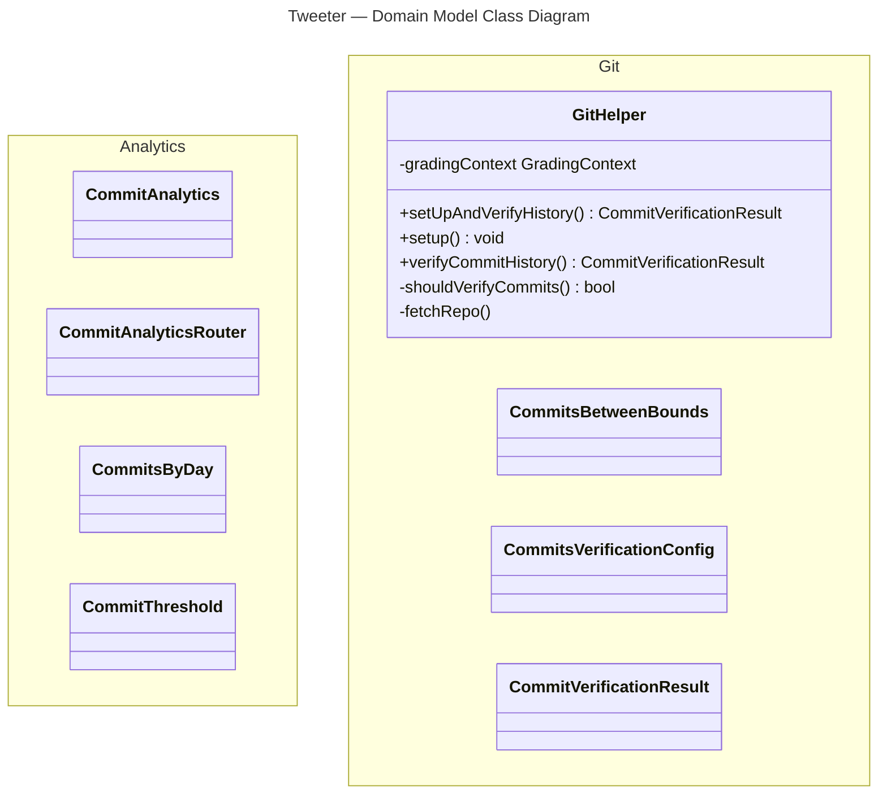

# Git Commit Verification — Class Diagram

```mermaid
---
title: Tweeter — Domain Model Class Diagram
---

classDiagram

namespace Analytics {
    class CommitAnalytics
    class CommitAnalyticsRouter
    class CommitsByDay
    class CommitThreshold
}

namespace Git {
    class GitHelper {

        -gradingContext GradingContext
        +setUpAndVerifyHistory() CommitVerificationResult
        +setup() void
        +verifyCommitHistory() CommitVerificationResult
        -shouldVerifyCommits() bool
        -fetchRepo()
    }

    class CommitsBetweenBounds
    class CommitsVerificationConfig
    class CommitVerificationResult
}

```
