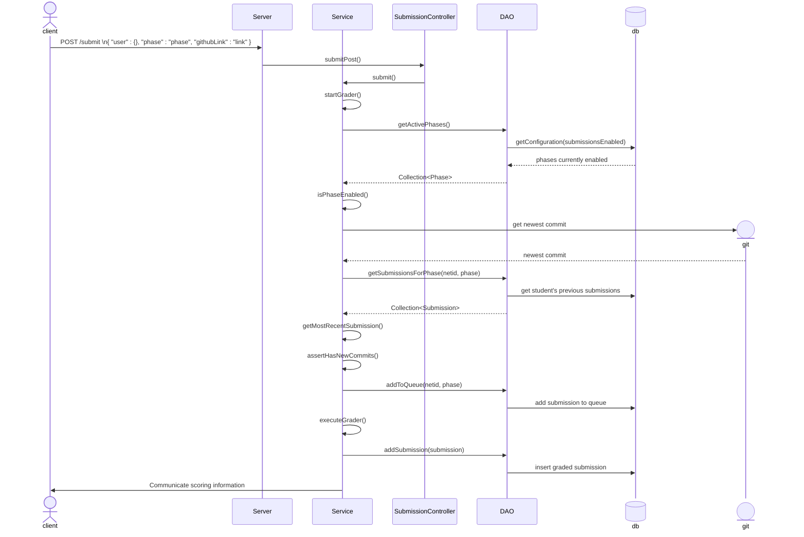
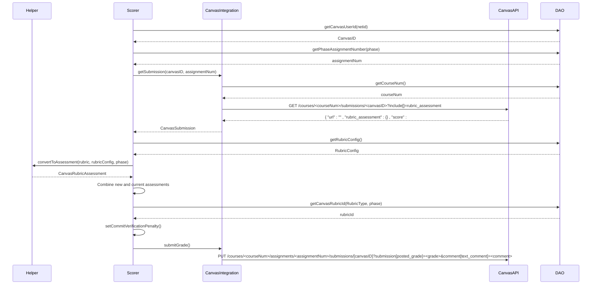

## Overview

The UML diagrams present a high-level representation of the interactions among the system components, clarifying the internal architecture and behavior of the autograder.
Any changes that impact the flow of the diagram should be accompanied by corresponding updates to ensure the diagram remains relevant.

The autograder's interaction with BYU's authentication service (OAuth 2.0) is described [here](https://developer.byu.edu/data/api-usage/learn-about-oauth-2-0). 
You will need to log in to your BYU student account to access the documentation.
It will not be covered in the diagram because it happens before the student is granted access to the autograder and does not happen as part of the grading flow.

### Autograder Submission Flow
The following diagram provides a high-level overview, similar to the sequence diagram for phase 2 of the chess project. It traces a single submission from request to completion.
The diagram is simplified as follows: 
- Does not differentiate between the different Service classes or DAOs but refers to them collectively as `Service` and `DAO` respectively.
- Models only the backend.
- Omits Error handling and paths.
- Encapsulates supporting utilities and grading infrastructure within the `Service` component for simplicity.

More specific details concerning the grading flow can be seen [here](#grading-flow-diagram)

### Grading flow diagram
The following diagram expands on the `executeGrader()` step from the previous diagram. Only one Grader is executed in the diagram, which models its execution from start to completion.
Refer to the class diagram (_not yet created_) for more information.
Multiple Graders are managed by an [Executor Service](https://docs.oracle.com/javase/8/docs/api/java/util/concurrent/ExecutorService.html) with a threadpool size of 1. 
Upon completion, a `Submission` is created and uploaded to the database. The diagram is simplified as follows:
- `PreviousPhasePassoffTestGrader` is abstracted and is represented by Grader.
- Canvas integration is abstracted and modeled [here](#canvas-integration-diagram). All interaction with canvas happens immediately before `Scorer` returns the `Submission` to `Grader`
- One DAO is used to represent all DAOs used, in addition to `DatabaseHelper`.
- Supporting utility classes (`GitHelper`, `CompileHelper`, `TestHelper`, `LateDayCalculator`) are identified collectively as `Helper`.
- The diagram represents the grading flow for a non-admin user; admin-specific behavior is not shown.
- The timeline of the Sequence Diagram begins at the invocation of the `run()` method in `Grader`.
- Exception handling is largely ignored.
- Logical flow is represented only for phases 0–6; grading for the GitHub repository assignment or submissions for code quality alone follow a similar flow with minor variations.

```mermaid
sequenceDiagram
    participant user
    participant TrafficController
    participant GradingObserver
    participant Grader
    participant Helper
    participant Scorer
    participant dao as DAO
    
    Grader->>GradingObserver:notifyStart()
    GradingObserver->>dao:markStarted(netid)
    GradingObserver->>TrafficController:notifySubscribers(netid, { "type", "started" })
    TrafficController->>user:notify start
    
    Grader->>Helper:setUpAndVerifyHistory()
    Helper->>GradingObserver:update("Fetching Repo...")
    GradingObserver->>TrafficController:notifySubscribers(netid, { "type", "update" })
    TrafficController->>user:"Fetching Repo..."
    
    Helper->>GradingObserver:update("Verifying Commits...")
    GradingObserver->>TrafficController:notifySubscribers(netid, { "type", "update" })
    TrafficController->>user:"Verifying Commits..."
    
    alt git commit verification contains warnings
        Helper->>GradingObserver:notifyWarning(warningMessage)
        GradingObserver->>TrafficController:notifySubscribers(netid, { "type", "warning" })
        TrafficController->>user:Warning Message    
    end
    Helper-->>Grader:CommitVerificationReport
    
    Grader->>dao:setup()
    dao->>dao:Create User
    dao->>dao:Grant Privileges
    dao->>dao:inject db.config file into student repo
    
    Grader->>Helper:compile()
    Helper->>Helper:verify()
    Helper->>GradingObserver:update("Verifying Code...")
    GradingObserver->>TrafficController:notifySubscribers(netid, { "type", "update" })
    TrafficController->>user:"Verifying Code..."
 
    Helper->>Helper:modify necessary files
    
    Helper->>Helper:build project
    Helper->>GradingObserver:update("Compiling Code...")
    GradingObserver->>TrafficController:notifySubscribers(netid, { "type", "update" })
    TrafficController->>user:"Compiling Code..."
    
    Grader->>Grader:run previous phase passoff tests
    Grader->>GradingObserver:update("Compiling previous phase passoff tests...")
    GradingObserver->>TrafficController:notifySubscribers(netid, { "type" : "update" })
    TrafficController->>user:"Compiling previous phase passoff tests..."
    Grader->>Helper:compileTests()
    Grader->>GradingObserver:update("Running previous phase passoff tests...")
    GradingObserver->>TrafficController:notifySubscribers(netid, { "type" : "update" })
    TrafficController->>user:"Running previous phase passoff tests..."
    Grader->>dao:getRubricConfig(phase)
    dao-->>Grader:RubricConfig
    
    Grader->>Grader:run passoff tests
    Grader->>GradingObserver:update("Compiling passoff tests...")
    GradingObserver->>TrafficController:notifySubscribers(netid, { "type" : "update" })
    TrafficController->>user:"Compiling passoff tests..."
    Grader->>Helper:compileTests()
    Grader->>GradingObserver:update("Running passoff tests...")
    GradingObserver->>TrafficController:notifySubscribers(netid, { "type" : "update" })
    TrafficController->>user:"Running passoff tests..."
    Grader->>dao:getRubricConfig(phase)
    dao-->>Grader:RubricConfig
    
    Grader->>Grader:run unit tests
    Grader->>GradingObserver:update("Compiling unit tests...")
    GradingObserver->>TrafficController:notifySubscribers(netid, { "type" : "update" })
    TrafficController->>user:"Compiling unit tests..."
    Grader->>Helper:compileTests()
    Grader->>GradingObserver:update("Running unit tests...")
    GradingObserver->>TrafficController:notifySubscribers(netid, { "type" : "update" })
    TrafficController->>user:"Running unit tests..."
    Grader->>dao:getRubricConfig(phase)
    dao-->>Grader:RubricConfig

    Grader->>Grader:run extra credit tests
    Grader->>GradingObserver:update("Compiling extra credit tests...")
    GradingObserver->>TrafficController:notifySubscribers(netid, { "type" : "update" })
    TrafficController->>user:"Compiling extra credit tests..."
    Grader->>Helper:compileTests()
    Grader->>GradingObserver:update("Running extra credit tests...")
    GradingObserver->>TrafficController:notifySubscribers(netid, { "type" : "update" })
    TrafficController->>user:"Running extra credit tests..."
    Grader->>dao:getRubricConfig(phase)
     dao-->>Grader:RubricConfig
   
    Grader->>Grader:run code quality
    Grader->>dao:getRubricConfig(phase)
    dao-->>Grader:RubricConfig
    Grader->>GradingObserver:update("Running code quality...")
    GradingObserver->>TrafficController:notifySubscribers(netid, { "type" : "update" })
    TrafficController->>user:"Running code quality..."
    
    Grader->>Scorer:score(rubric)
    Scorer->>GradingObserver:update("Grading...")
    GradingObserver->>TrafficController:notifySubscribers(netid, { "type" : "update" })
    TrafficController->>user:"Grading..."
    Scorer->>Helper:calculateLateDays()
    Helper-->>Scorer:numDaysLate
    Scorer->>Scorer:applyLatePenalty()
    Scorer-->>Grader:Submission
    
    Grader->>dao:insertSubmission()
    Grader->>GradingObserver:notifyDone(submission)
    GradingObserver->>TrafficController:notifySubscribers(netid, { "type" : "results" })
    TrafficController->>user:grading results
    Grader->>dao:db cleanup
```

### Canvas Integration Diagram

Interaction between Canvas and the Autograder during grading is modeled below.
The Scorer's entry point is the `score()` method, which is traced from beginning to end.
At the end of the scoring sequence, `Scorer` returns a `Submission` to the `Grader`

