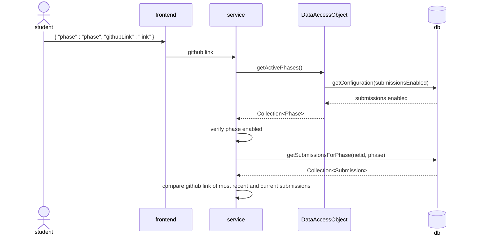

## Overview

The autograder is a complicated project with many moving pieces and those who created it are no longer around to explain what is going on. 
Thus, the need for better documentation has become more prevalent so that future TAs can be effective contributors to the autograder. 

The UML diagram provides a high-level view of the interactions between all the moving parts of the autograder so that its inner mechanisms can be better understood. 
Additional functionality or changes that impact the flow of the diagram should be accompanied by a corresponding change to the diagram so that it does not become obsolete.

The flow of the autograder's interaction with BYU's authentication service (OAuth 2.0) is described [here](https://developer.byu.edu/data/api-usage/learn-about-oauth-2-0). 
You will need to log in to your BYU student account to access the documentation.
It will not be covered in the diagram because it happens before access to the autograder is granted to the student, and does not happen as part of the grading flow as they submit a phase to be graded.

## Sequence Diagram
