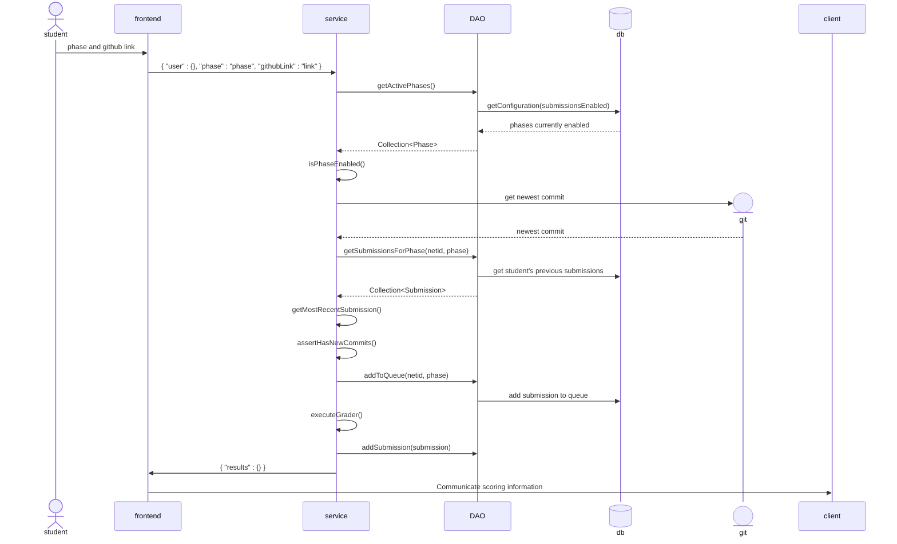
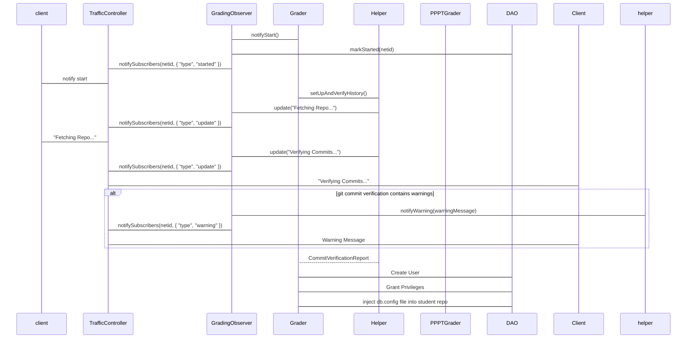

## Overview

The autograder is a complicated project with many moving pieces and those who created it are no longer around to explain what is going on. 
Thus, the need for better documentation has become more prevalent so that future TAs can be effective contributors to the autograder. 

The UML diagrams provide a high-level view of the interactions between all the moving parts of the autograder so that its inner mechanisms can be better understood. 
Additional functionality or changes that impact the flow of the diagram should be accompanied by a corresponding change to the diagram so that it does not become obsolete.

The autograder's interaction with BYU's authentication service (OAuth 2.0) is described [here](https://developer.byu.edu/data/api-usage/learn-about-oauth-2-0). 
You will need to log in to your BYU student account to access the documentation.
It will not be covered in the diagram because it happens before access to the autograder is granted to the student, and does not happen as part of the grading flow.

### High level view of client-server-database relationships << needs better name
The following diagram is a high-level overview that is similar to the sequence diagram for phase 2 of the chess project.
It is simplified in the following ways: 
- It does not differentiate between the different service classes or DAOs but refers to them collectively as `service` and `DAO` respectively.
- It treats the frontend as a single entity,
- It does not include error paths
- various utility classes and the entire Grading process is abstracted to the Service classes. 
More specific details concerning the grading flow can be seen [here](#grading-flow-diagram)

### Grading flow diagram
The following diagram represents everything abstracted in the previous diagram by the method executeGrader(). 
Refer to the class diagram (_not yet created_) to better understand how the mechanism of the grader.
The graders are managed by an [Executor Service](https://docs.oracle.com/javase/8/docs/api/java/util/concurrent/ExecutorService.html) with a threadpool size of 1.
Upon completion, a Submission is created and uploaded to the database. The diagram has been simplified such that:
- any communication sent to the frontend is simply received by `client` in the diagram.
- `PPPTGrader` stands for PreviousPhasePassoffTestGrader.
- One DAO is used to represent all DAOs used, in addition to `DatabaseHelper`.
- Various helper classes (`GitHelper`, `CompileHelper`) are identified collectively as `Helper`.
- The diagram indicates the grading flow for a user without admin status. The logic changes are negligible for the purposes of the diagram.
- The timeline of the Sequence Diagram begins with the execution of the run() method in Grader.
- Exception Handling is largely ignored.
